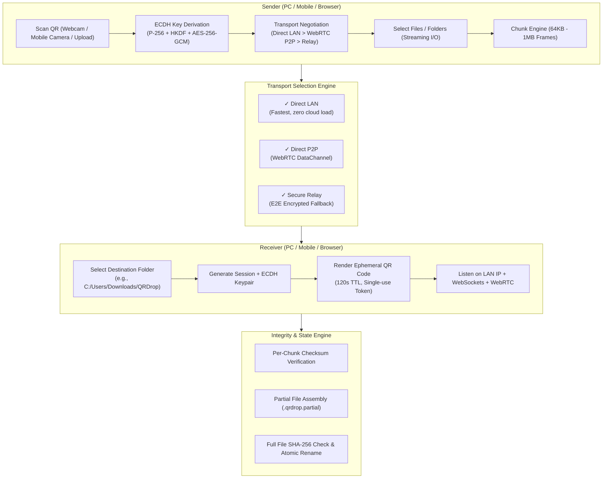
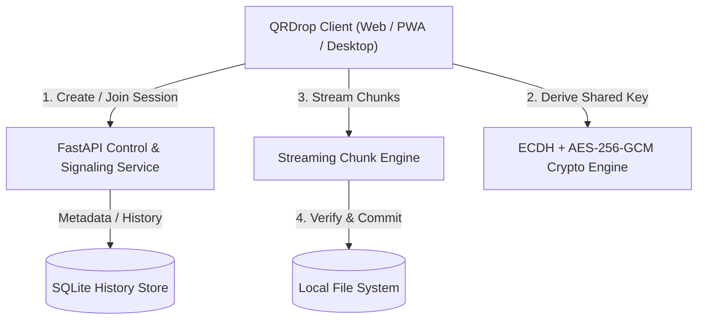

# QRDrop Architecture Specification

## 1. System Overview

QRDrop is a high-speed, universal cross-platform file transfer platform designed around the principle: **"Scan. Select. Send."**

The platform decouples discovery and pairing from the data path:
- **Pairing & Discovery**: Uses single-use dynamic QR codes containing ephemeral tokens and ECDH public keys.
- **Data Transfer**: Automatically selects the fastest available secure transport:
  1. **Direct LAN**: High-throughput HTTP/WebSocket direct transfer over local subnets.
  2. **Direct P2P**: WebRTC `RTCDataChannel` direct browser-to-browser / device-to-device transport via STUN.
  3. **Secure Relay**: End-to-end encrypted fallback relay via the FastAPI WebSocket backend for restrictive symmetric NATs and firewalls.



---

## 2. Component Architecture



### QRDrop Core
- **`backend/app/core/state.py`**: State machine enforcing strict transitions:
  `CREATED` → `QR_GENERATED` → `WAITING` → `PAIRING` → `CONNECTED` → `AWAITING_APPROVAL` → `APPROVED` → `TRANSFERRING` → `VERIFYING` → `COMPLETED`.
- **`backend/app/security/tokens.py`**: Single-use token manager with 120s TTL and replay-attack cache.
- **`backend/app/security/sanitizer.py`**: Strict path traversal barrier neutralizing `..`, absolute drives, null bytes, and Windows reserved filenames (`CON`, `PRN`, `AUX`, `NUL`).
- **`backend/app/transfer/chunk_engine.py`**: Memory-bounded streaming chunk manager writing to `.qrdrop.partial` files with resume state tracking.
- **`shared/crypto/crypto.ts` & `backend/app/security/crypto.py`**: Interoperable Web Crypto API and Python Cryptography implementation of ECDH P-256 and AES-256-GCM.

---

## 3. Pairing & Connection Negotiation

```mermaid
sequenceDiagram
    autonumber
    actor Receiver
    actor Sender
    participant Backend as FastAPI Backend

    Receiver->>Receiver: Select Destination Folder
    Receiver->>Backend: POST /api/session/create (Receiver PubKey)
    Backend-->>Receiver: Session ID, Ephemeral Token, QR Payload
    Receiver->>Receiver: Render QR Code (120s TTL)
    
    Sender->>Sender: Scan QR Code with Camera
    Sender->>Backend: POST /api/session/join (Token, Sender PubKey)
    Backend->>Backend: Validate Token & Replay Check
    Backend-->>Receiver: Signal: SENDER_CONNECTED
    
    Sender->>Sender: Compute Shared AES-256-GCM Key (ECDH)
    Receiver->>Receiver: Compute Shared AES-256-GCM Key (ECDH)
    
    Sender->>Backend: POST /api/session/{id}/manifest (Files, Sizes, Relative Paths)
    Backend-->>Receiver: Signal: TRANSFER_REQUEST
    Receiver->>Receiver: Prompt User: Accept or Reject?
    Receiver->>Backend: POST /api/session/{id}/approve (True)
    Backend-->>Sender: Signal: TRANSFER_ACCEPT
    
    Note over Sender,Receiver: Data Transport: Direct LAN &gt; WebRTC P2P &gt; Relay
    
    loop Each File Chunk
        Sender->>Receiver: POST /api/transfer/upload-chunk (Chunk Bytes, Offset, Hash)
        Receiver->>Receiver: Verify Chunk Hash & Write to .qrdrop.partial
        Receiver-->>Sender: ACK: OK
    end
    
    Sender->>Receiver: POST /api/transfer/finalize-file
    Receiver->>Receiver: Compute Full SHA-256 & Compare Manifest
    Receiver->>Receiver: Atomic Rename: .qrdrop.partial &rarr; final_name
    Receiver-->>Sender: Finalized: VERIFIED
```
