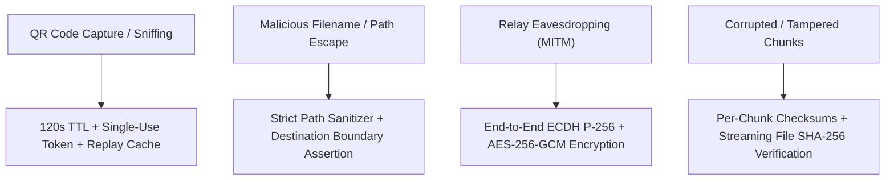

# QRDrop Security & Threat Model

## 1. Security Architecture & Threat Model

QRDrop implements zero-trust receiver verification, end-to-end cryptographic confidentiality, strict single-use pairing protection, and absolute filesystem path sanitization.



---

## 2. Cryptographic Implementation

QRDrop uses standard, battle-tested cryptography (no custom ciphers):
- **Key Exchange**: Ephemeral Elliptic Curve Diffie-Hellman (**ECDH**) using curve **SECP256R1 / P-256**.
- **Key Derivation**: **HKDF-SHA256** deriving a 256-bit symmetric key using contextual salt `b"QRDrop-v1-Salt"` and info `b"QRDrop-Transfer-Key"`.
- **Authenticated Symmetric Cipher**: **AES-256-GCM** with a cryptographically random 12-byte initialization vector (IV) per chunk payload and 128-bit authentication tag.
- **Integrity**: Streaming **SHA-256** calculated progressively over chunk boundaries and checked against the sender manifest prior to file finalization.

### Cross-Platform Parity
The crypto implementation is tested and identical between the browser (**Web Crypto API** via `window.crypto.subtle`) and backend/desktop (**Python Cryptography** via `cryptography.hazmat`).

---

## 3. Path Traversal & Filesystem Hardening

Remote senders cannot write outside the receiver's chosen destination directory.

```python
# Boundary Assertion in backend/app/security/sanitizer.py
dest_root = Path(destination_dir).resolve()
target_path = (dest_root / safe_relative_path / safe_filename).resolve()

try:
    target_path.relative_to(dest_root)
except ValueError:
    raise PathTraversalError("Attempted path escape outside destination boundary")
```

### Neutralized Vectors:
1. **Directory Traversal**: `../../`, `..\..\`, `/etc/passwd`, `C:\Windows\System32\calc.exe` are stripped, and any lingering `..` components raise a `PathTraversalError`.
2. **Null Byte Injection**: `file.txt\0.exe` is stripped of `\0`.
3. **Windows Reserved Names**: Filenames starting with `CON`, `PRN`, `AUX`, `NUL`, `COM1-9`, `LPT1-9` are automatically prefixed with `safe_` (e.g. `safe_CON.txt`) to prevent OS handle lockups.
4. **Partial Files Quarantine**: Transfers write only to `.qrdrop.partial` until the full SHA-256 is validated. Incomplete or corrupted files are never presented to the operating system as complete files.

---

## 4. QR Pairing Security & Replay Protection

- QR payloads contain an ephemeral, cryptographically random 256-bit token (`secrets.token_urlsafe(32)`).
- **TTL**: 120 seconds.
- **Single-Use Enforcement**: When a sender pairs, the token is recorded in `_consumed_tokens`. Replay attempts with the same QR code are immediately rejected with `403 Forbidden`.
- **Receiver Approval**: Pairing does NOT grant immediate write access. The receiver UI prompts the user with the incoming sender device details and file manifest before any file data can be transferred.
